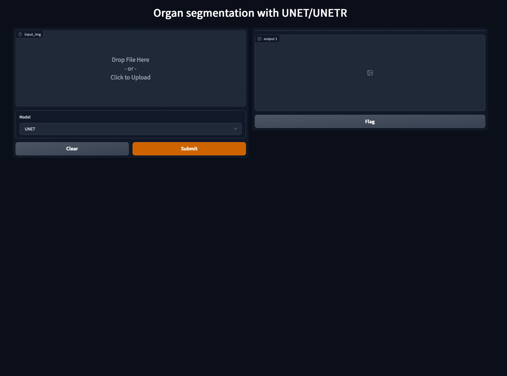
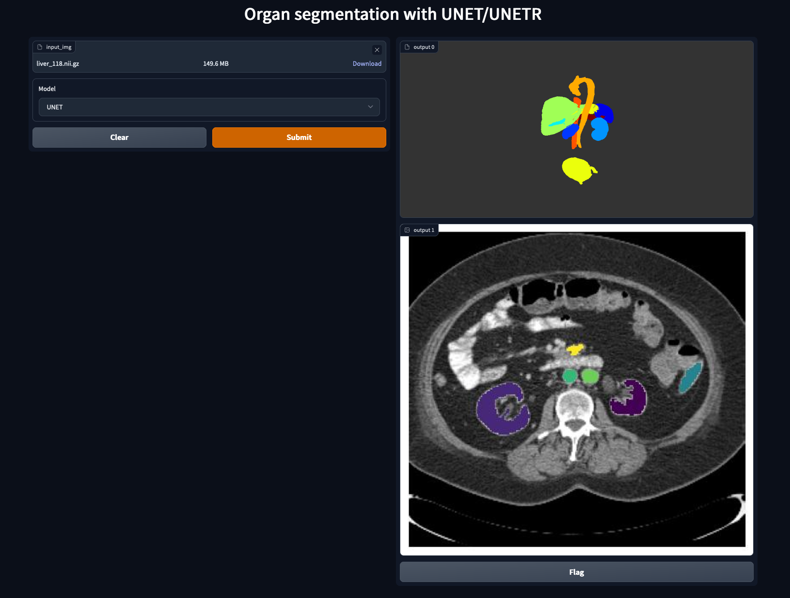

# Gradio with MONAI and UNET/UNETR for multi-organ segmentation 

*[Work in progress]*

This repo explores using [Gradio](https://gradio.app/) with medical imaging models to drag and drop medical imaging volumes into a web interface and get an automatic multi-organ segmentation.

- Run app
- Drag and drop a nifti image
- Get an automatic multi-organ segmentation
- 3D mesh rendering of the segmentated organs

*Note that a trained model is not provided and this example requires the user train a model using the BTCV dataset (https://www.synapse.org/#!Synapse:syn3193805/discussion/default) and the notebook provided. In future I'll provide a demo with a trained model included using a dataset with known licencing*. 

Before:

After dragging image:

*Data from the [Medical Image Decathlon](http://medicaldecathlon.com/) (CC-BY-SA)*

## Run

*Note that this doesn't currently include a trained model needed to run the demo. For this you need to download the BTCV dataset and train a model using the colab/python notebook provided*

- Train a model using the notebook provided (unet_btcv_segmentation_3D.ipynb) 
- Save the trained model in the models folder
- Create python environment
- Install requirements: `pip install -r requirements.txt`
- Launch the gradio frontend: `python hello_world_pipeline.py`

## TODO
- [ ] Include some sort of progress bar in gradio
- [ ] Include UNETR
- [ ] Preview of nifti once loaded
